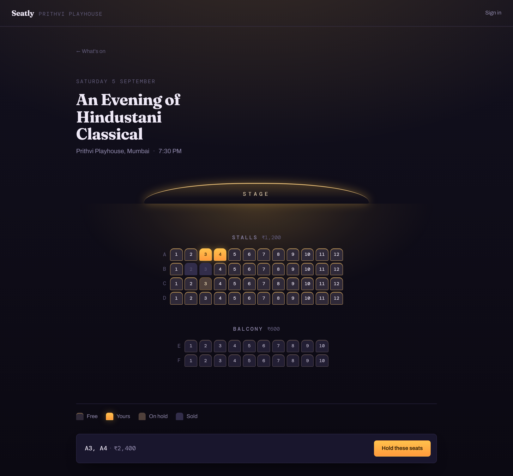
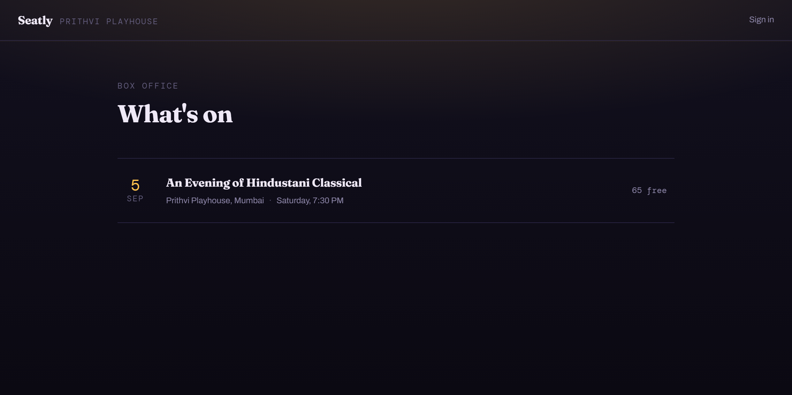

# Seatly

[](https://github.com/Amankumar017/event-ticket-booking/actions/workflows/ci.yml)

Event ticket booking with seat-level concurrency control.



Selling a numbered seat is one of the few genuinely hard problems hiding inside
an ordinary CRUD application: the moment two people click the same seat in the
same instant, correctness depends entirely on how the write is serialised.
Seatly exists to work that problem end to end: a naive implementation that
demonstrably double-books, the measurements that expose it, and the locking
strategy that fixes it.

The stage is the only light in the room, and it falls off across the rows. The
stalls sit in it, the balcony sits at the edge of it, and that is also the price
gradient: in this hall the closer seats cost more.



## Stack

| Layer    | Choice                                              |
| -------- | --------------------------------------------------- |
| Backend  | Java 21, Spring Boot 4, Spring Data JPA             |
| Database | PostgreSQL 17, schema migrated by Flyway            |
| Cache    | Redis 8 (seat holds with TTL)                       |
| Frontend | Angular 20 (standalone components, signals)         |
| Testing  | JUnit 5, Testcontainers                             |
| Metrics  | Micrometer, Prometheus, Grafana                     |

## Running locally

Requires Docker, a JDK 21 or newer, and Node 20.19+ for the frontend. Maven is
supplied by the wrapper.

```bash
docker compose up -d                                    # Postgres 5433, Redis 6380
cd backend
./mvnw spring-boot:run -Dspring-boot.run.profiles=seed   # http://localhost:8090
```

The `seed` profile puts one venue and one on-sale event into the database, and
does nothing if they are already there.

```bash
cd frontend
npm start                     # http://localhost:4200
```

The dev server proxies `/api` to port 8090, so the browser sees a single origin.
CORS is configured separately for deployments where the two are served apart.

Health, including database and Redis connectivity:

```bash
curl http://localhost:8090/actuator/health
```

Tests boot the application against throwaway containers, so Docker must be
running but the compose stack need not be:

```bash
cd backend
./mvnw test
```

## If it does not start

**"Could not find a valid Docker environment"** during tests or startup. Docker
Desktop is installed but not running. The tests bring up their own PostgreSQL and
Redis through Testcontainers, so the daemon has to be up even when the compose
stack is not.

**"Port 8090 was already in use"**, or the same for 4200, 5433 or 6380. Usually a
server left running from earlier. Find and stop it:

```bash
lsof -i :8090          # macOS, Linux
netstat -ano | findstr :8090    # Windows, then taskkill /PID <pid> /F
```

**`./mvnw: Permission denied`** on macOS or Linux, if the executable bit is lost
in transit: `chmod +x backend/mvnw`.

**`npm start` fails on the Node version.** Angular 20 needs Node 20.19 or newer.
Check with `node -v`.

**The site says "Can't reach the box office".** The frontend is up and the
backend is not. The dev server proxies `/api` to port 8090, so both have to be
running.

**Sign-in is rejected.** The demo accounts only exist under the `seed` profile.
Look for this line in the backend output:

```
Seeded 2 account(s): customer@example.com / organiser@example.com
```

**"Migration checksum mismatch"** means a migration file changed after it had
already run against that database. Migrations are immutable once applied. For a
local database with nothing worth keeping:

```bash
docker exec seatly-postgres psql -U seatly -d seatly \
  -c "drop schema public cascade; create schema public;"
```

## Ports

Non-default host ports are used throughout so the stack can run alongside other
local services.

| Service     | Host port |
| ----------- | --------- |
| Angular     | 4200      |
| Application | 8090      |
| PostgreSQL  | 5433      |
| Redis       | 6380      |
| Grafana     | 3001      |
| Prometheus  | 9091      |

## Accounts

```
POST   /api/auth/register                       create an account and sign in
POST   /api/auth/login                          sign in
POST   /api/auth/refresh                        renew, using the refresh cookie
POST   /api/auth/logout                         end this session
GET    /api/auth/me                             who am I
```

The access token is short-lived, signed, and returned in the response body for
the client to hold in memory. The refresh token never appears in a body at all:
it lives in an http-only, `SameSite=Strict` cookie scoped to `/api/auth`, so no
script on the page can read it and no other site can cause it to be sent.

Refresh tokens are **rotated**: each one may be spent exactly once, and using it
issues a successor. A token that has already been spent turning up again means
two parties hold it, so the whole session family is revoked and both are made to
sign in. Stored as SHA-256 hashes, never in the clear.

Browsing is open to anyone. Buying requires an account, and identity comes from
the verified token rather than from anything in the request body.

Seeded accounts under the `seed` profile, both with password `seatly-demo-pass`:
`customer@example.com` and `organiser@example.com`.

## Booking a seat

```
GET    /api/events                              what is on sale
GET    /api/events/{id}/seats                   the seating chart
POST   /api/bookings                            hold seats for five minutes
POST   /api/bookings/{reference}/cancellation   give the seats back early
GET    /api/bookings/{reference}                look one up
GET    /api/bookings/mine                       your bookings
POST   /api/payments/intents/{bookingReference} open a payment  (Idempotency-Key)
POST   /api/payments/webhook                    the provider reports the outcome
GET    /api/events/{id}/seats/stream             live seat changes (SSE)
```

A hold is a PENDING booking with a deadline. Pay before it lapses and the seats
are sold; miss it and they go back on sale immediately, because availability is
decided from the deadline itself rather than from a background job having caught
up. The job exists to make the stored state agree.

There is no way to confirm a booking without paying for one. Confirmation
happens in the webhook handler, which is why it takes no notice of who is signed
in: a payment provider does not have an account here.

## Paying, exactly once

Three things stand between "the customer clicked once" and "the customer was
charged once", and all three are needed because none of them covers the others:

**`Idempotency-Key` on opening a payment.** A client whose request times out
cannot tell whether it worked. Sending the same key again returns the first
answer rather than opening a second payment. The key is scoped per account and
fingerprinted against the request body, so reusing it for different content is
refused (422) rather than answered with the wrong reply. Eight simultaneous
callers using one key produce exactly one execution, measured in
`IdempotencyConcurrencyTest`.

**Webhook deduplication.** Providers deliver at least once. Every delivery is
recorded by the provider's own event id behind a unique index; the second
arrival is acknowledged and does nothing.

**HMAC signatures.** The webhook endpoint is a public URL that turns unpaid
bookings into paid ones. Deliveries are signed over the raw request body and
compared in constant time; an unsigned or wrongly signed callback gets a 401.

The confirmation email is written to an **outbox** in the same transaction that
confirms the booking, and delivered afterwards by a separate job. Sending inside
the transaction would email people about bookings that then rolled back; sending
after it commits loses the message if the process dies in between.

## Live seat updates

Open two browsers on the same chart and one sees the other take a seat, without
polling and without a reload.

Changes are announced while the booking still holds its seat locks, but nothing
leaves the building until the transaction commits. The listener is
`AFTER_COMMIT`, because there is no unsending an SSE message and a rolled-back
booking must never be shown as a taken seat. A test proves exactly that: a hold
that fails on its second seat broadcasts nothing about its first.

Server-sent events rather than WebSockets, because the traffic goes one way and
browsers already know how to reconnect an `EventSource`. Redis pub/sub sits in
the middle so that a seat sold on one instance reaches the browsers connected to
every other one, since a live connection belongs to one JVM and cannot be
shared.
Idle streams get a comment line every twenty seconds, since anything between the
browser and the server treats a silent socket as a dead one.

Failures come back as RFC 9457 problem documents, so `Seat A1 is no longer
available` arrives as text a client can show rather than a status code it has to
interpret.

## The interface

The page is the auditorium with the lights down, and the stage is the only light
in it. That light falls off across the rows, with the stalls sitting in it and
the balcony at the edge of it. The falloff is not decoration: in this hall the
closer seats cost more, so it *is* the price gradient. Picking a seat gives it the
light back.

Indigo and marigold rather than the theatre-dark-and-neon that a booking app
usually reaches for: both belong to the room this is modelling. Fraunces for the
bill, Archivo for reading, DM Mono for the things that are really data: seat
numbers, prices, the countdown, the booking reference.

## Under load

Two hundred customers arriving at once, from
[`SeatRushLoadTest`](backend/src/test/java/com/seatly/load/SeatRushLoadTest.java):

| Scenario                     | Granted | Refused | Errors | Seats claimed twice |
| ---------------------------- | ------- | ------- | ------ | ------------------- |
| 200 customers, a seat each   | 200     | 0       | **0**  | **0**               |
| 200 customers, the same seat | 1       | 199     | **0**  | **0**               |

Throughput ranged from 67 to 172 holds a second across three runs of the
sell-out scenario. The spread is what a laptop does, and quoting one number
would be inventing a precision that is not there. The counts in bold are the
part that never moved. Full numbers, and why the latencies look the way they
do, in [docs/load.md](docs/load.md).

```bash
docker compose up -d                                        # includes Prometheus and Grafana
cd backend && ./mvnw test -Dtest=SeatRushLoadTest -DexcludedTestGroups=none
```

Grafana at <http://localhost:3001> comes with the dashboard provisioned: hold
latency percentiles, the seats sold and released, webhook deliveries by outcome,
outbox depth, the Redis guard's decisions, and the connection pool's pending
count, which is what explains the latencies above.

## Status

Under construction. Seats can be browsed, held, paid for and cancelled; holds
expire on their own; customers sign in with rotating refresh tokens; and
payments are idempotent end to end; seat changes stream live to every open
browser; and the whole thing is instrumented and load tested.

What the unlocked version did under load, and what fixed it, is written up with
its measurements in [docs/concurrency.md](docs/concurrency.md).
